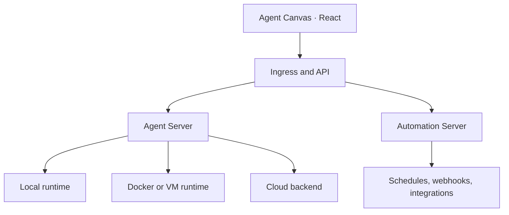

<a name="readme-top"></a>
<div align="center">


# Madagascar Agent Canvas

### The command center for autonomous software engineering.

Launch, supervise, and automate coding agents across local machines, Docker sandboxes, remote infrastructure, and cloud backends—from one unified workspace.


[Quickstart](#quickstart) · [Architecture](#architecture) · [Agent backends](https://docs.madagascar.dev/madagascar/usage/agent-canvas/backends) · [Automations](https://docs.madagascar.dev/madagascar/usage/agent-canvas/prebuilt-automations) · [Documentation](https://docs.madagascar.dev/overview/introduction)

</div>

<p align="center">
  
</p>

---

## From a coding agent to an engineering system

A coding agent can solve a task. Madagascar turns agents into durable engineering infrastructure.

Agent Canvas provides the control plane for interactive conversations, parallel development work, scheduled jobs, and event-driven automations. Teams can connect multiple agent servers, choose the right runtime for each workload, and keep execution close to the code—on a laptop, inside an isolated container, on a dedicated VM, or within managed infrastructure.

It works with the open-source Madagascar agent and supports Claude Code, Codex, Gemini, and other [Agent Client Protocol](https://docs.madagascar.dev/madagascar/usage/agent-canvas/acp-agents) compatible agents.

## Core capabilities

| Capability | What it unlocks |
|---|---|
| Unified agent workspace | Start, inspect, resume, and manage coding sessions from one interface |
| Pluggable backends | Move between local, containerized, remote, and cloud runtimes |
| Persistent execution | Keep long-running agents active beyond the lifetime of a laptop session |
| Workflow automation | Trigger engineering work on schedules or through webhook events |
| Tool integrations | Connect GitHub, Slack, Linear, Notion, and other operational systems |
| Bring your own model | Configure the model/provider profile that fits the workload |
| Team-ready topology | Separate personal agents, shared services, and infrastructure-sensitive jobs |
| Open protocol support | Run third-party ACP-compatible agents without redesigning the control plane |

## Architecture



Each Agent Server owns one execution environment and exposes a REST interface for managing multiple agent sessions. Agent Canvas can connect to several servers, making infrastructure a selectable runtime rather than a hard-coded constraint.

The automation layer adds durable triggers and integrations, allowing agents to respond to issues, publish reports, perform dependency work, and execute recurring engineering routines.

## Quickstart

### Option 1 — install the CLI

> [!WARNING]
> A non-sandboxed agent can access the host filesystem with the permissions of the current user. Use a dedicated environment for untrusted work.

**Requirements:** Node.js 22.12+ and `uv`.

```bash
npm install -g @madagascar/agent-canvas
agent-canvas
```

Open [http://localhost:8000](http://localhost:8000).

Run only part of the stack when needed:

```bash
agent-canvas --frontend-only
agent-canvas --backend-only
```

### Option 2 — Docker sandbox

Create a host directory containing only the projects the agent should access:

```bash
export PROJECTS_PATH="$HOME/projects"
mkdir -p "$PROJECTS_PATH" "$HOME/.madagascar"

docker run -it --rm \
  -p 8000:8000 \
  -v "$HOME/.madagascar:/home/madagascar/.madagascar" \
  -v "$PROJECTS_PATH:/projects" \
  ghcr.io/madagascar/agent-canvas:1
```

The mounted `PROJECTS_PATH` becomes the agent's visible workspace. Review the [self-hosting guide](https://docs.madagascar.dev/madagascar/usage/agent-canvas/backend-setup/vm) before exposing the service beyond a trusted network.

### Option 3 — build from source

```bash
git clone https://github.com/midnighthunters/madagascar.git
cd madagascar
make install-pre-commit-hooks
make build
make run
```

For component-level workflows, environment variables, testing, and contribution standards, see [Development.md](./Development.md).

## Repository structure

```text
madagascar/
├── frontend/      # React application and Agent Canvas UI
├── madagascar/    # Python agent, server, runtime, and integrations
├── backend/       # Automation and supporting backend services
├── desktop/       # Desktop packaging
├── agentcore/     # Agent execution primitives
├── skills/        # Reusable agent capabilities
├── containers/    # Container build/runtime definitions
└── scripts/       # Development and release tooling
```

## Deployment models

| Model | Best for | Isolation |
|---|---|---|
| Direct local | Fast personal development | Host-user boundary |
| Docker | Reproducible and constrained projects | Container boundary |
| Dedicated VM | Always-on agents and remote access | Machine boundary |
| Shared server | Team workflows and central governance | Configurable |
| Managed infrastructure | Reduced operational overhead | Provider-managed |

## Example workflows

- Turn a GitHub issue into an implementation plan and executable task set.
- Run a recurring repository health or dependency report and publish it to Slack.
- Keep an agent working on a remote machine while the local computer is offline.
- Route security-sensitive work to an internal backend and experimentation to a local sandbox.
- Switch between Claude Code, Codex, Gemini, and Madagascar without changing the workspace.
- Combine scheduled and event-driven triggers with reusable skills.

## Security model

Agentic systems can execute commands, edit files, and interact with connected services. Treat runtime design as part of the product—not an afterthought.

- Mount only directories an agent genuinely needs.
- Prefer containers or dedicated VMs for high-autonomy workloads.
- Keep credentials scoped, revocable, and isolated by environment.
- Restrict network exposure and place remote instances behind authenticated ingress.
- Review third-party skills and integrations before enabling them.
- Follow the [self-hosting security guidance](https://docs.madagascar.dev/madagascar/usage/agent-canvas/backend-setup/vm).

## Development

```bash
make install-pre-commit-hooks
make build
```

The backend is Python-based; the frontend is built with React and TanStack Query. The repository also includes a VS Code integration, desktop packaging, Docker workflows, and automated checks. Consult [AGENTS.md](./AGENTS.md) before making changes and [CONTRIBUTING.md](./CONTRIBUTING.md) before opening a pull request.

## Project status

Madagascar Agent Canvas is in beta and evolving rapidly. The Agent and Agent Server source is transitioning to [Madagascar/software-agent-sdk](https://github.com/Madagascar/software-agent-sdk), while the Agent Canvas source is available at [Madagascar/agent-canvas](https://github.com/Madagascar/agent-canvas). See the [transition FAQ](https://github.com/Madagascar/Madagascar/issues/14841) for context.

## Community and documentation

- [Product documentation](https://docs.madagascar.dev/overview/introduction)
- [Backend setup](https://docs.madagascar.dev/madagascar/usage/agent-canvas/backends)
- [Prebuilt automations](https://docs.madagascar.dev/madagascar/usage/agent-canvas/prebuilt-automations)
- [Contribution guide](./CONTRIBUTING.md)
- [Community](./COMMUNITY.md)

---

<div align="center">

Build once. Delegate continuously. Keep control.

</div>
